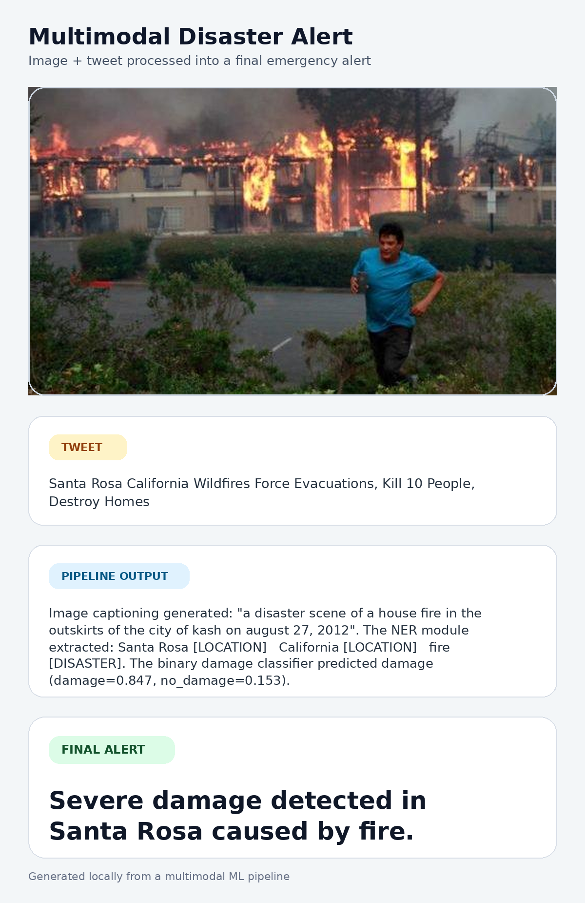
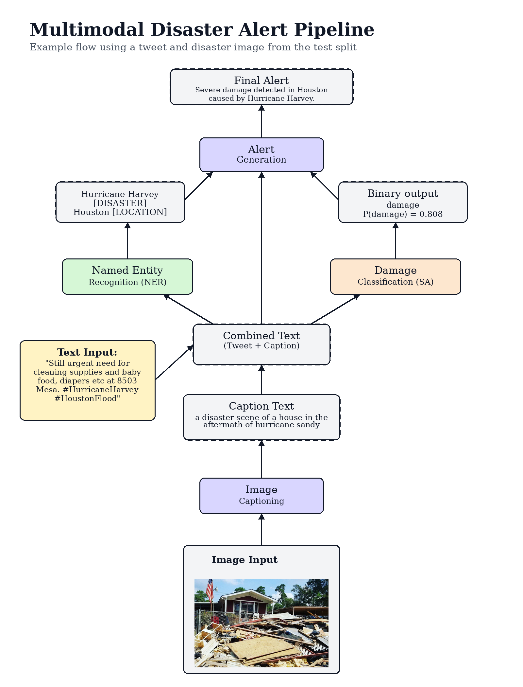

# Multimodal Disaster Alert Pipeline

End-to-end machine learning pipeline for generating disaster alerts from a tweet and an associated image.

The system combines:

- BLIP image captioning
- a custom NER model for disaster/location extraction
- a binary damage classifier
- rule-based final alert generation

Pipeline:

```text
image -> caption -> tweet + caption -> NER + damage classification -> final alert
```

## Demo Outputs

### Final Alert Card



### Pipeline Diagram



## Repository Structure

```text
data/
  NER_data/                 NER datasets and labels
  SA_data/                  damage classification CSV files
docs/
  project_report_3class_original.pdf
images/
  train/, dev/, test/       local image splits used by the CSV files
models/
  ner/                      saved custom NER model
  sa_transformer_binary/    binary damage classifier, generated locally
outputs/
  multimodal_fire_alert_card.png
  multimodal_houston_harvey_flow.png
src/
  captioning.py
  predict_ner.py
  predict_sa_transformer_binary.py
  train_ner.py
  train_sa_transformer_binary.py
  evaluate_ner_metrics.py
  evaluate_sa_metrics_binary.py
  demo_pipeline_binary.py
  make_linkedin_demo_card.py
  make_pipeline_flow_diagram.py
```

The report in `docs/project_report_3class_original.pdf` corresponds to the original 3-class version of the project (`low`, `mid`, `high` damage). The current code includes the improved binary setup used for the final demo.

## Setup

Recommended Python version: `3.11`.

```bash
python3 -m venv .venv
source .venv/bin/activate
pip install -r requirements.txt
```

The image captioning module uses:

```text
Salesforce/blip-image-captioning-base
```

If the BLIP checkpoint is not cached locally yet, download it once with:

```bash
python3 - <<'PY'
from transformers import BlipProcessor, BlipForConditionalGeneration

model_name = "Salesforce/blip-image-captioning-base"
BlipProcessor.from_pretrained(model_name)
BlipForConditionalGeneration.from_pretrained(model_name)
PY
```

After that, the project loads BLIP with `local_files_only=True`.

## Model Artifacts

The custom NER checkpoint is small enough to keep in the repository:

```text
models/ner/
```

The transformer damage classifiers are intentionally ignored by Git because each checkpoint is larger than GitHub's 100 MB file limit:

```text
models/sa_transformer/
models/sa_transformer_binary/
```

To reproduce the final binary classifier locally:

```bash
python3 src/train_sa_transformer_binary.py
```

This creates:

```text
models/sa_transformer_binary/
```

For publishing the trained checkpoint, use Git LFS, a GitHub Release asset, or a Hugging Face model repository.

## Metrics

Current evaluated results:

| Component | Setup | Metric |
| --- | --- | --- |
| NER | custom character/word BiLSTM | entity-level F1: `0.9795` |
| SA | original 3-class classifier | accuracy: `0.4889`, macro-F1: `0.4842` |
| SA | binary damage classifier | accuracy: `0.7111`, macro-F1: `0.5963` |
| SA | binary classifier with threshold `0.55` | accuracy: `0.7111`, macro-F1: `0.6400` |

The binary classifier maps the original damage labels into:

```text
0 -> no_damage
1, 2 -> damage
```

## Running The Pipeline

Run the binary multimodal demo:

```bash
python3 src/demo_pipeline_binary.py --split test --row-index 41
```

This prints:

- input tweet
- image path
- generated caption
- NER entities
- binary damage probabilities
- final alert

It also writes a visual report to:

```text
outputs/demo_pipeline_binary.png
```

Run the main pipeline entry point:

```bash
python3 src/main.py
```

## Evaluate Models

Evaluate NER:

```bash
python3 src/evaluate_ner_metrics.py
```

Evaluate the binary damage classifier:

```bash
python3 src/evaluate_sa_metrics_binary.py
```

Analyze binary decision thresholds:

```bash
python3 src/analyze_sa_binary_thresholds.py
```

## Generate Portfolio Images

Generate the final alert card:

```bash
python3 src/make_linkedin_demo_card.py \
  --split test \
  --row-index 41 \
  --output outputs/multimodal_fire_alert_card.png
```

Generate the pipeline diagram:

```bash
python3 src/make_pipeline_flow_diagram.py \
  --split test \
  --row-index 39 \
  --output outputs/multimodal_houston_harvey_flow.png
```

## Notes

- `data/SA_data/caption_cache.json` is generated automatically and is ignored by Git.
- The final binary classifier is the recommended model for demos and portfolio usage.
- The original 3-class SA scripts are kept for comparison and reproducibility.
