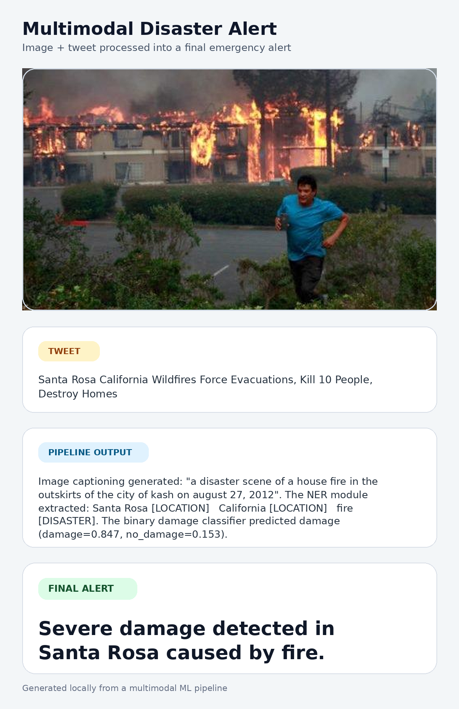
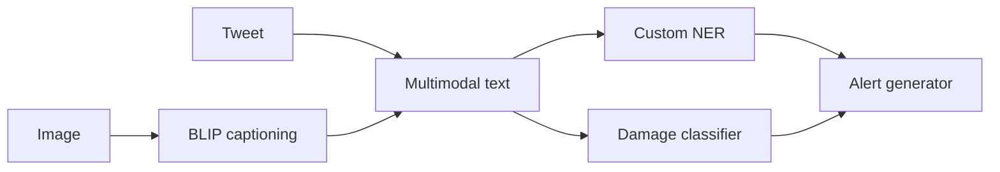
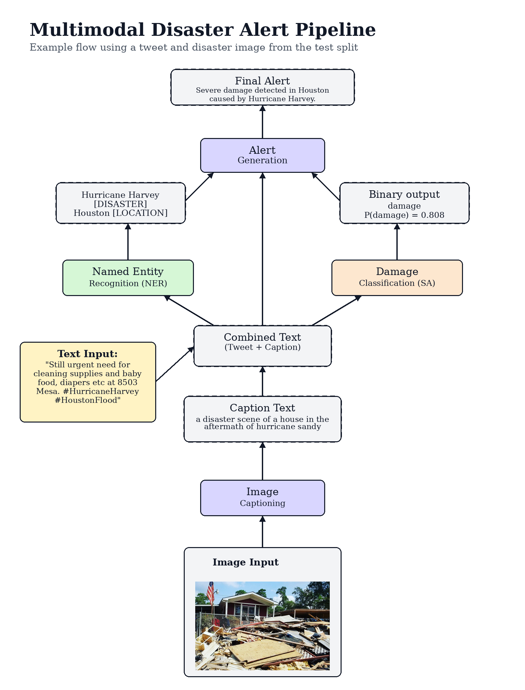

# Multimodal Disaster Alert Pipeline

An end-to-end machine learning pipeline that turns a social-media post and its associated image into a structured disaster alert.

It combines image captioning, custom named-entity recognition and binary damage classification so that the final decision uses both text and visual context.



## How it works


```mermaid
flowchart LR
    I[Image] --> C[BLIP captioning]
    T[Tweet] --> F[Multimodal text]
    C --> F
    F --> N[Custom NER]
    F --> D[Damage classifier]
    N --> A[Alert generator]
    D --> A
```

1. **Image captioning** — BLIP converts the image into a textual description.
2. **Multimodal fusion** — the tweet and filtered image caption are combined.
3. **Information extraction** — a custom word/character BiLSTM identifies disasters, locations and other crisis entities.
4. **Damage assessment** — a transformer classifier predicts `damage` or `no_damage`.
5. **Alert generation** — rules combine the extracted entities and damage prediction into a final alert.



## Results

| Component | Evaluation data | Result |
| --- | --- | --- |
| Custom NER | Held-out synthetic, domain-aligned test split | Entity-level F1: `0.9795` |
| Original 3-class damage model | CrisisMMD-derived test split | Accuracy: `0.4889`; macro-F1: `0.4842` |
| Final binary damage model | CrisisMMD-derived test split | Accuracy: `0.7111`; macro-F1: `0.5963` |
| Binary model, threshold `0.55` | Same test split | Accuracy: `0.7111`; macro-F1: `0.6400` |

The binary task maps the original labels as follows:

```text
0    -> no_damage
1, 2 -> damage
```

The NER score comes from a small synthetic dataset of 300 domain-aligned sentences, so it should be interpreted as an internal held-out result rather than evidence of broad real-world generalization.

## Tech stack

- Python and PyTorch
- Hugging Face Transformers
- BLIP image captioning
- Custom BiLSTM-based NER
- Transformer-based sequence classification
- pandas, scikit-learn and Matplotlib

## Repository structure

```text
data/       NER and damage-classification datasets
docs/       Original project report
images/     CrisisMMD image splits used by the pipeline
models/     Versioned NER checkpoint; local damage checkpoints
notebooks/  Data-preparation notebook
outputs/    Portfolio-ready demo images
src/        Training, evaluation, inference and visualization code
```

## Run locally

Python 3.11 is recommended.

```bash
git clone https://github.com/bertranvidal/multimodal-disaster-alert-pipeline.git
cd multimodal-disaster-alert-pipeline
python3 -m venv .venv
source .venv/bin/activate
pip install -r requirements.txt
```

On Windows PowerShell:

```powershell
.venv\Scripts\Activate.ps1
```

BLIP is downloaded automatically from Hugging Face on first use.

### Prepare the final damage model

The trained binary damage checkpoint is not committed because it exceeds GitHub's file-size limit. Recreate it locally with:

```bash
python src/train_sa_transformer_binary.py
```

This writes the checkpoint to `models/sa_transformer_binary/`.

### Run the end-to-end demo

```bash
python src/demo_pipeline_binary.py --split test --row-index 41
```

The command prints every pipeline stage and creates `outputs/demo_pipeline_binary.png`.

You can also use your own tweet and image:

```bash
python src/demo_pipeline_binary.py \
  --text "Flooding has damaged several homes in Houston" \
  --image-path path/to/image.jpg
```

### Evaluate the models

```bash
python src/evaluate_ner_metrics.py
python src/evaluate_sa_metrics_binary.py
python src/analyze_sa_binary_thresholds.py
```

## Model artifacts

The custom NER model is versioned in `models/ner/`. The larger transformer checkpoints are excluded through `.gitignore`. A production release should publish them through Git LFS, a GitHub Release or a model registry such as Hugging Face Hub.

## Data and limitations

- The damage-classification subset is derived from [CrisisMMD](https://arxiv.org/abs/1805.00713), a multimodal dataset collected from social-media posts during natural disasters.
- The NER dataset is synthetic and designed specifically for this domain.
- This is an experimental portfolio project, not a production emergency-response system.
- Predictions can be affected by noisy posts, weak image-text alignment, class imbalance and captioning errors.

## License

Released under the [MIT License](LICENSE).
